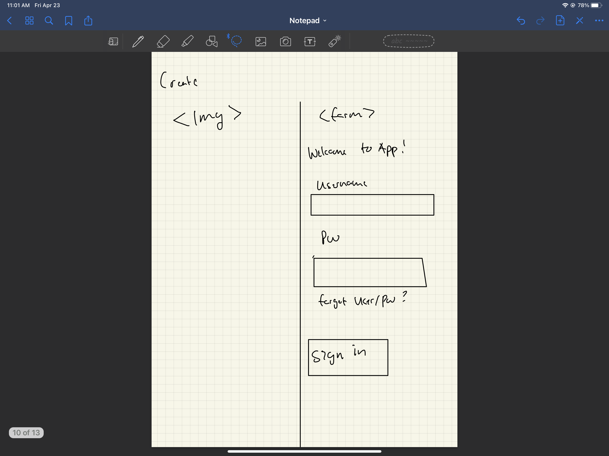
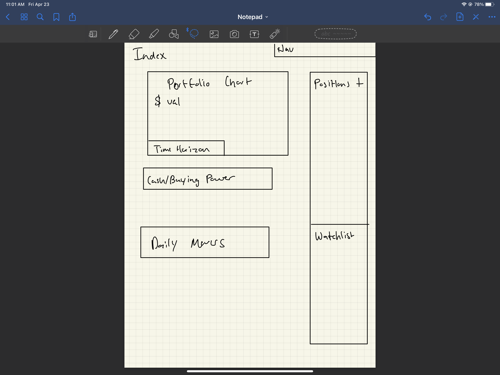
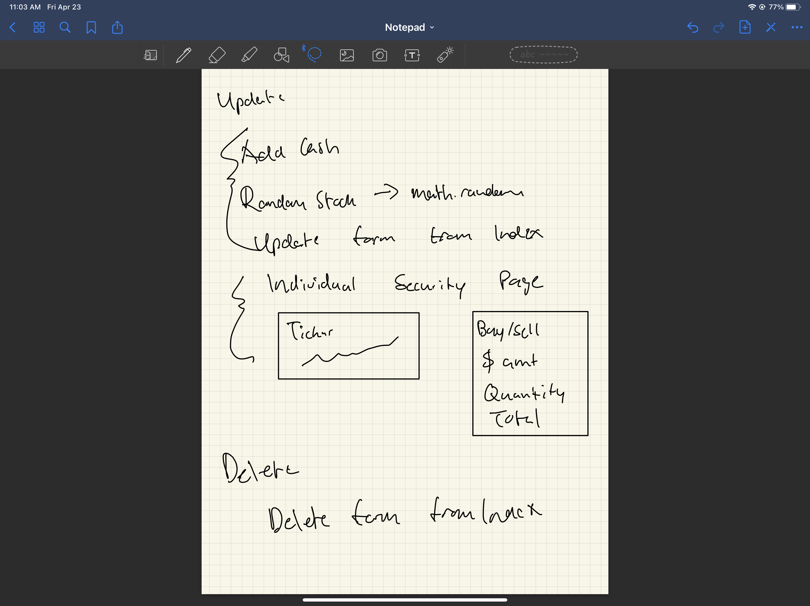
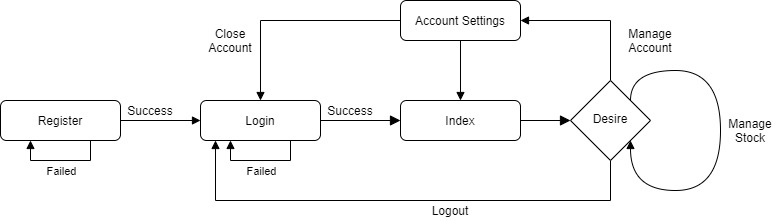
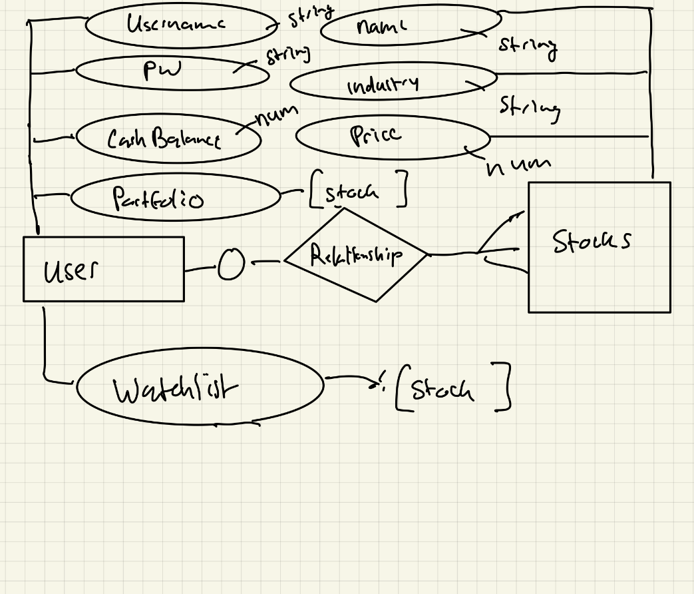

# Won-Ventures
Project 1 for GA SEI

A clearly defined Minimum Viable Product Scope:
  - User Authentication 
  - Cash Balance
  - Portfolio
  - Watchlist

Stretch Goals:
  - Graphs
  - Search

Wireframes for every page you plan on creating.
  
  
  

User Stories (divided into sprints).
  NEW USER: 
  - User comes to log in page 
    - Register new user form
      - Enter desired username + pw 
      - Submit form
  - Log in with new credentials 
  - On log in user will arrive at index page which shows 
    - Current holdings in portfolio
    - Watchlist
    - Portfolio performance chart -> daily, weekly, yearly 
    - Buying Power ($) 
    - Daily Movers (extra) 
  - In positions on index 
    - User can add new positions 
      - -> redirect to a create page where user can specify: Amount of shares + Price to pay —> Total price for shares 
      - After submitting order, user will be redirected too index to view new shares added to portfolio 
        - Cash/Buying Power on index will change to reflect purchase/sale of securities 
  - In watchlist index 
    - User can add new positions 
      - Simply identify a security ticker, choose from available securities that match ticker 
      - Submit form
      - New security will be added to watchlist 
    - Vice versa for removing shares from portfolio/watchlist

User Flow for how the user will navigate the application.
  

- Database ERD for each resource. List the attributes you'll include in your schemas and what type of data each attribute will be.
  

